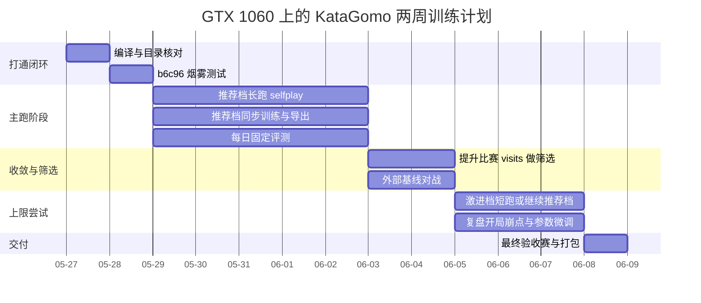

# 在 GTX 1060 单机上用 KataGomo 快速训练比赛级五子棋模型

## 执行摘要

如果你的目标是“在一到两周内、用单机 GTX 1060 级别显卡，基于 KataGomo 训出一个能打比赛、强度接近公开平均水平的五子棋模型”，最现实的判断是：**可以做到“可比赛、明显强于教学级/简化 AlphaZero 开源实现”的中档神经网络模型，但不现实指望从零自博弈追到 Gomocup 顶级引擎**。原因很直接：当前公开强引擎里，Rapfi 走的是更省算力的 alpha-beta + NNUE 路线，而 JAX 这类神经-MCTS 系统公开描述里已经训练了 **200 万到 1000 万局**；Gomocup 2024 中 Rapfi 拿下了 freestyle 15/20、fastgame、standard、renju 多个组别冠军，JAX 也处于前列。与此同时，NVIDIA 官方公开规格页里常见桌面版是 **GTX 1060 3GB/6GB**，并无官方“1060 Ti”型号，因此下文按 **GTX 1060 6GB** 这一最常见、也更符合训练需求的预算做估算；若你实际是 3GB 版，所有 batch 与模型档位都应再下调一级。citeturn47view0turn46view0turn24search10turn43search3

在这种约束下，我的明确建议是：**不要把目标设成“追顶级”，而要设成“尽快做出稳、能用、可迭代的单规则模型”**。具体做法是：先锁定一个比赛目标分支和一个盘面尺寸；standard、renju、caro 直接只训 15x15，freestyle 则按你实际参赛目标只训 15x15 或 20x20，而不要把稀缺算力分散到 13–19 的多尺寸混训上。KataGo 文档说明多尺寸混训在围棋里可以有效，但 Gomocup 当前规则和盘面是明显分开的；对单卡短周期，专注单目标盘面对最终比赛值更高。citeturn48view0turn45search4turn45search10turn47view0

从工程路径上看，最稳的路线不是一上来就冲“大网 + 高 visits”，而是走三阶段：**先用轻网打通闭环，再切到推荐档长期跑，最后只在收尾阶段提高比赛搜索量做筛选**。KataGo 官方自博弈训练文档明确把闭环拆成自博弈、洗牌、训练、导出、gatekeeper 五段，也明确说单机小规模训练可以走同步或半同步流程，并且在小机上不使用 gating 会更快、更省算力；同时官方建议自博弈侧计算量一般应高于训练侧，量级可到 4 倍到 40 倍。把这些建议翻译到你的场景，就是：**时间预算上大约让自博弈占 65%–75%，训练占 20%–25%，评估占 10% 左右**。citeturn25view0turn26view0

就参数起点而言，我建议你把 **KataGomo Gom2024 自带 selfplay.cfg 当成第一参考系**，而不是把普通 AlphaZero Gomoku 仓库的 `cpuct=4` 或 `cpuct=5` 生搬硬套进 KataGo 系配置。原因是 KataGomo 的配置沿用了 KataGo 式搜索参数：例如 Gom2024 的公开 selfplay 配置已经给出 `maxVisits=100`、`chosenMoveTemperatureEarly=0.75`、`chosenMoveTemperatureHalflife=6`、`chosenMoveTemperature=0.15`、`rootDirichletNoiseWeight=0.25`、`rootDirichletNoiseTotalConcentration=10.83`、`cpuctExploration=1.0`、`cpuctExplorationLog=0.45`、`cpuctExplorationBase=500`、`useGraphSearch=true`、`numVirtualLossesPerThread=1` 这一整套 Gomoku 向起点；而常见开源 AlphaZero Gomoku 项目用的是更简化的公式，README 与配置里常见的是 `numMCTSSims=400~800`、`cpuct=4~5`、`temp_threshold` 或早期温度步数阈值。两套参数**不可直接同量纲比较**。citeturn6view0turn7view0turn37view0turn38view0turn40view0turn42view0

结论先给出来：**你的主跑配置应以 15x15 单尺寸、`maxVisits=96~128`、早期温度退火、保留 Dirichlet 噪声、强化开局随机化、rolling data window、关 gating、固定外部基线评测为核心**；模型档位上，若 Gom2024 分支确实提供作者在 training guide 中提到的 `b10c256n`，就把它作为主力档；若本地脚本里没有这个模型码，则退回官方可验证的 `b10c128` 或更轻的 `b6c96` 先跑通。KataGomo 的训练说明也明确提到：模型大小和 batch 应该按照显存改，较慢但更强的选择包括 `b15c192n` 或 `b12c256n`，而 `b10c256n` 被作者标成较小、较快、强度“正常偏强”的选择。citeturn3view0turn27view0

## 证据基础与任务边界

本报告优先采用四类证据，并在建议里显式标注证据等级。**“官方”** 指 KataGomo 仓库、KataGo 官方文档与配置、KataGo 论文、Gomocup 官方页面；**“社区惯用”** 指有代表性的 AlphaZero Gomoku 开源项目参数与公开说明；**“经验估计”** 指我基于 GTX 1060 规格、模型规模与卷积 FLOPs 做的工程推算；**“需验证”** 指分支内未完整文档化、你必须本地 grep/干跑确认的内容。这个分层很重要，因为 KataGomo 的 `scripts/train` 目录在公开仓库里是占位形式，训练说明又写明“通常 Python 代码不需要改，部分分支会在 `./scripts` 上传训练脚本与配置”，这意味着**你最终执行时，分支实际文件状态比 README 更重要**。citeturn27view0turn44search0turn3view0

“公开平均水平”这个说法本身并没有统一官方度量，所以我这里给出一个更可操作的定义：**不是指 Gomocup 前列，也不是指 Rapfi/JAX 这种当前公开强引擎，而是指在固定规则、固定盘面、固定搜索量下，能稳定压过简化 AlphaZero Gomoku 教学实现，且在面对公开强引擎时不至于完全崩盘的中档比赛模型**。这样定义的原因是，Gomocup 2024 的公开信息已经显示顶级系统差异非常大：Rapfi 是极强的传统搜索+NNUE 引擎，JAX 则在多规则多盘面上使用了 KataGo 方法并训练了 200 万到 1000 万局；而 KataGomo 公开 release 中也已经提供了更强的 `b28c512nbt` 模型。拿单张 1060 两周 scratch 自博弈去追这些系统，不是好的目标管理。citeturn47view0turn46view0turn20view0

比赛边界也必须先锁死。Gomocup 当前公开规则里，**standard、renju、caro 是 15x15**；freestyle 则已同时存在 **15x15 与 20x20** 组别，不同组别时间限制也不同，常规比赛常见的是 30 秒/步、180 秒/局，fastgame 更紧。Gomocup 2024 还给各规则准备了固定开局，unlimited 组则采用 Swap2。对你来说，这意味着如果近期目标是“比赛可用”，那训练分布里必须显式加入**规则对应开局随机化**，否则从空盘自博弈采样出来的分布和比赛分布会偏得很厉害。citeturn24search2turn24search3turn45search4turn45search10turn47view0

我还想强调一个容易被忽略的现实判断：**如果你追求的是“有限算力下的绝对比赛强度”，纯 CNN+MCTS 并不是五子棋里最省算力的路线**。Rapfi 2025 论文与项目说明都把重点放在“limited computation environments”下的优势，而且它在工程上借助增量更新与 NNUE/alpha-beta，更适合极限算力压榨。你当前选择 KataGomo，真正的优势不是“同等算力必胜”，而是**框架成熟、强化学习闭环齐全、可快速迭代规则与特征**。所以本报告的目标是帮你把 KataGomo 路线跑到“最划算”，而不是混淆为“这就是五子棋最强训练路线”。citeturn23search0turn46view0

## 自博弈数据与搜索策略

### 自博弈的主原则

KataGo 官方自博弈训练说明有两个对你最关键的启发。第一，闭环训练里自博弈、洗牌、训练、导出、gatekeeper 是相互制约的，如果训练算力过强，会等数据；如果自博弈过强，训练会追不上。第二，官方建议在异步大规模训练里，自博弈侧 GPU 力通常比训练侧高很多，量级可达 4 倍到 40 倍。放到你的单机单卡场景，这等价于：**不要追求“训练步数越多越好”，而要追求“单位时间内，数据质量和新鲜度的平衡”**。我建议你把长期运行策略定成“小窗滚动 + 中等 visits + 高频导出 + 固定评测”，而不是“大窗积压 + 低频更新”。citeturn25view0turn26view0

Gom2024 分支给出的 Gomoku selfplay 起点本身就说明作者在五子棋上更偏向**低 visits、高并发、较强开局扰动**：公开配置里 `maxVisits=100`、`numSearchThreads=1`、`numGameThreads=512`、`chosenMoveTemperatureEarly=0.75`、`chosenMoveTemperatureHalflife=6`、`chosenMoveTemperature=0.15`、`rootNoiseEnabled=true`、`rootDirichletNoiseWeight=0.25`、`cpuctExploration=1.0`、`cpuctExplorationLog=0.45`、`useGraphSearch=true`。这和 KataGo 围棋大网后期常见的 1500–2000 visits 显著不同，也说明**五子棋分支作者已经在用更轻搜索换更快闭环**。你的单卡方案应该在这个坐标系附近微调，而不是大幅偏离。citeturn6view0turn7view0

### 我建议的自博弈起点

下表是我建议你直接使用的参数带。表里的“官方”来自 KataGomo Gom2024 默认 selfplay 配置与 KataGo 官方训练配置；“社区惯用”来自 AlphaZero Gomoku 开源项目；“经验估计”则是根据 1060 6GB 做的工程折中。

| 维度 | 建议起点 | 证据等级 | 说明 |
|---|---|---|---|
| 目标总局数 | **8,000–20,000 局/两周** | 经验估计 | 15x15 单规则为前提；少于 5,000 局通常只能得到“像样但不稳”的模型 |
| 日均局数 | **500–1,500 局/天** | 经验估计 | 推荐网 + 96–128 visits 的现实预算；轻网可更高 |
| `numGameThreads` | **64–128** | 官方 + 经验估计 | 官方大配置把线程开很大是为了吃批量；单卡单机不必照搬 512/800 |
| `nnMaxBatchSize` | **64–96** | 官方 + 经验估计 | 1060 6GB 上比 128/192 更稳，且更不容易抖动 |
| `maxVisits` | **主跑 96–128；验收 160–256** | 官方 + 经验估计 | Gom2024 默认 100，适合作为主跑中心点 |
| `cheapSearchProb` | **0–0.15** | 官方 + 经验估计 | 围棋官方配置常用 cheap search；Gom2024 默认 0，更稳妥 |
| 早期采样温度 | `chosenMoveTemperatureEarly=0.75~0.8` | 官方 | 直接沿 Gom2024 量级即可 |
| 温度退火 | `halflife=6~10`，末期 `0.10~0.15` | 官方 + 社区惯用 | Gom2024 用 6；简化 AlphaZero 项目也普遍只在前若干手用高温 |
| 根节点噪声 | `weight=0.20~0.25`，concentration 先保留 `10.83` | 官方 | 先不要改浓度，只改是否启用和权重 |
| 开局随机化 | **4–8 手 policy-init + 12–50 个平衡开局种子** | 官方 + 经验估计 | 比赛分布比空盘自博弈更重要 |
| 数据窗口 | **0.6M–1.2M rows** | 官方 + 经验估计 | 单卡短周期优先“小而新”，不用追 5M 大桶 |
| 去重 | **优先做开局多样化；去重只做“完全重复局/重复状态”** | 经验估计 | 五子棋里开局坍缩比精细 dedup 更伤 |
| `-max-train-bucket-per-new-data` | **4 起步，最多 5** | 官方 | 官方把 4 明确标成 conservative，过大有过拟合风险 |

这些建议的骨架来自 KataGo 与 KataGomo 的公开配置与训练说明；其中日均局数、窗口大小和对 1060 的并发折中，是我依据 GTX 1060 6GB 规格和小盘卷积网络 FLOPs 做的工程预算，属于**经验估计，必须用你的实机日志校准**。citeturn26view0turn34view0turn35view0turn36view0turn6view0turn7view0turn43search3

### MCTS 参数怎么取才不跑偏

这里我给一个很明确的观点：**在 KataGomo/KataGo 风格配置里，不要把普通 AlphaZero Gomoku 仓库的 `cpuct=4`、`cpuct=5` 直接映射到 `cpuctExploration` 上**。普通开源 AlphaZero Gomoku 实现在 README 或配置里常见 `numMCTSSims=400~800`、`cpuct=4.0~5`；而 KataGo/KataGomo 则把探索项拆成了 `cpuctExploration`、`cpuctExplorationLog`，有时还带 `cpuctExplorationBase`、LCB、root policy temperature、graph search 等额外机制。真正可迁移的是“探索强度的大致倾向”，不是数值本身。对你而言，**最安全的范围就是把 Gom2024 的 `cpuctExploration=1.0` 当中心，只在 `0.95~1.10` 内微调**。citeturn6view0turn7view0turn37view0turn38view0turn40view0turn42view0

关于虚拟损失、graph search 与线程数，我建议更保守一些。Gom2024 默认 `numSearchThreads=1`、`useGraphSearch=true`、`numVirtualLossesPerThread=1`。这说明作者已经把五子棋分支压到了“单线程搜索 + 图搜索”的简洁形态。对单张 1060 来说，这也是合理的：**先保持 `numSearchThreads=1`，虚拟损失不用主动加大；如果你后续为了比赛引擎想并行搜索，再去测试 `numSearchThreads=2` 是否真带来增益**。很多单卡场景下，搜索线程多了不一定更快，反而会让查询与缓存行为更差。citeturn6view0turn7view0

训练与比赛要分开看。训练自博弈里我建议你保留根节点噪声、保留温度退火、保留 policy-init 开局扰动；比赛模式则应**关闭噪声，把温度降到 0 或非常小，并把 visits 提到训练时的 2–4 倍**。Gomocup 的比赛时间约束很明确，fastgame 常见是 5 秒/步、120 秒/局，其他组别常见 30 秒/步、180 秒/局，final 更宽松。所以你训练时可以用 96–128 visits 把数据做出来，评估时再用 400–800 visits 测“真实棋力”，最后依照比赛时间再决定 800 还是 1600 是最终引擎档位。citeturn24search2turn24search3turn45search10turn47view0

### 开局随机化比去重更重要

这个点我想讲得更重一些。Gomocup 2024 为各规则都准备了固定开局，unlimited 组还采用了 Swap2；JAX 2024 的官方描述里也明确写了“random balanced openings”和“historical Gomocup openings”被加入了 self-play。对于五子棋这种开局偏置强的棋类，**如果你不把开局分布做宽，模型最容易发生的不是“不会下”，而是“只会下自己熟悉的窄开局，比赛一被带出书就质量骤降”**。所以在你的优先级里，应当是：先做平衡开局种子，再做 policy-init 温度，然后才轮到是否做复杂 dedup。citeturn47view0turn45search12

## 网络结构与训练超参数

### 先说一个关键判断

如果你只有 1060 6GB，而且时间只给一到两周，**最优策略不是一开始就追大模型，而是追“单位时间内最强的闭环”**。KataGo 官方文档列出的网络码里，`b6c96`、`b10c128`、`b18c384nbt` 都是公开可验证的模型定义；其中 `b18c384nbt` 使用了 nested bottleneck 结构，官方方法文档还明确指出它与一批新优化一起，做到了**和旧 `b40c256` 接近的速度，但每 eval 强度接近更重的旧大网**。这说明架构效率确实重要。另一方面，KataGomo 的训练指导又把 `b10c256n` 标成小而快、强度“正常偏强”的优先选择，把 `b15c192n` 与 `b12c256n` 标成更慢更强。落到你的场景，就是：**先用官方可验证小网做 smoke test，再在分支原生大一点的网和官方稳定网之间做折中**。citeturn31view0turn31view1turn31view2turn32view0turn48view0turn3view0

### 输入特征与头部设计的实用建议

KataGomo README 明确说游戏逻辑与输入特征主要在 `board.*`、`boardhistory.*`、`nninput.cpp`，而“通常 Python 代码不需要改”；KataGo 的方法文档则说明它的网络是**共享 trunk + 规模无关的 head**，并通过 global pooling 和 masking 支持多盘面尺寸，head 不是那种强依赖 `H*W` 的全连接大头。对你来说最稳的策略是：**尽量保留 Gom2024 分支现有输入特征，不要在第一轮训练里动输入 schema**。如果你后续真要改，只优先确保下面几类信息仍然存在：当前黑白子分布、轮到谁走、合法/禁手信息、最近若干手历史、board mask/盘面尺寸、规则相关标志。至于 head 宽度，直接沿模型码默认，不建议首轮自己乱改。citeturn44search0turn48view0turn27view0

这里要特别标一个**高风险点**：公开仓库并没有把 Gom2024 当前五子棋分支的 feature plane 逐项完整文档化，因此“精确的输入平面数、每个平面代表什么”这件事，**你必须以本地 `nninput.cpp` 为准**。这不影响你跑训练闭环，但会影响你是否去自定义蒸馏、可视化或重写前端。这个断言我放到后面的优先核验清单第一梯队。citeturn44search0turn27view0

### 轻量档、推荐档、上限档

下表把“官方可验证模型”和“KataGomo 分支推荐命名”合在一起看。参数量、推理时间、训练速度是我按 **15x15** 盘面、FP32 近似卷积 FLOPs、GTX 1060 6GB 预算做的**经验估计**；如果你跑的是 19x19 或 20x20，速度要分别再乘上大约 **1.6 倍**和**1.8 倍**的面积系数。表里的显存占用说的是**训练时建议安全区**，不是理论最小值。citeturn31view0turn31view1turn32view0turn3view0turn43search3

| 档位 | 优先模型码 | 证据等级 | 近似参数量 | 15x15 单样本推理时间 | 15x15 训练吞吐 | 1060 6GB 建议 batch | 训练显存安全区 |
|---|---|---:|---:|---:|---:|---:|---:|
| 轻量 | `b6c96` | 官方 + 经验估计 | 约 **1.0M** | 约 **0.8–1.5 ms** | 约 **350–600 samples/s** | **128** | **3–4 GB** |
| 稳妥推荐 | `b10c128` | 官方 + 经验估计 | 约 **3.0M** | 约 **2.4–4.5 ms** | 约 **120–220 samples/s** | **64–96** | **4–5 GB** |
| 分支推荐 | `b10c256n` | 需验证 + 经验估计 | 约 **12M** 量级 | 约 **9–15 ms** | 约 **30–60 samples/s** | **32–64** | **5–6 GB** |
| 上限尝试 | `b12c256n` 或 `b15c192n` | 需验证 + 经验估计 | 约 **10–14M** 量级 | 约 **11–18 ms** | 约 **25–50 samples/s** | **24–48** | **5.5–6 GB** |

这张表的解读很简单。**如果你重视“成功率”而不是“参数表好看”**，先从 `b6c96` 把闭环打通，然后切到 `b10c128` 长跑，是最稳的。**如果你确认 Gom2024 分支里真的带了 `b10c256n` 对应配置，并且 1060 6GB 实测 batch 32/64 不爆显存**，那它是最值得试的主跑档，因为它符合作者自己的训练指导。**上限档只适合放在后一周后半段**，前面没必要浪费时间撞 OOM 和调吞吐。citeturn3view0turn31view0turn31view1

### 训练超参数的取法

这里我同样给出一个明确意见：**首跑时不要把优化器、loss 权重、head 结构同时当成调参主战场**。KataGo 官方训练入口对外暴露得最明确的是 batch、`-lr-scale`、`-max-train-bucket-per-new-data`、`-max-train-bucket-size`、`-no-repeat-files`、`-epochs-per-export` 这类“训练节奏参数”，而不是鼓励你先改底层架构或多头损失。官方说明里也明确写了：训练脚本可以通过这些额外参数调节学习率尺度、每新数据允许训练多少步、是否重读旧 shuffle 等。对单卡短周期，节奏通常比“理论最优 optimizer”更重要。citeturn26view0

因此，我建议你的训练超参按下面这套来定：

| 项目 | 建议 | 证据等级 | 备注 |
|---|---|---|---|
| Optimizer | **沿用你复制进来的 `train.py` 默认实现** | 官方 + 需验证 | 不建议首轮改 optimizer 族 |
| 学习率 | 通过 `-lr-scale` 控制：轻量 **1.0**，推荐 **0.8**，上限 **0.6–0.7** | 官方 + 经验估计 | 比直接魔改 `train.py` 稳 |
| Batch size | 见上表 | 官方 + 经验估计 | 必须与 shuffler batch 保持一致 |
| `-max-train-bucket-per-new-data` | **4** 起步，最多 **5** | 官方 | 4 是官方保守值 |
| `-max-train-bucket-size` | **1.0M–1.5M** | 官方 + 经验估计 | 单卡短跑优先小窗 |
| `-no-repeat-files` | **开启** | 官方 | 防止对同一轮 shuffle 过度重复 |
| `-epochs-per-export` | **1–2** | 官方 + 经验估计 | 让 checkpoint 间隔更短，方便比赛筛选 |
| weight decay / loss 权重 | **先保留默认** | 需验证 | 当前 Python 版本不同，默认可能变化 |
| 梯度裁剪 | 若脚本支持，**1.0 global norm**；否则保持默认 | 社区惯用 + 需验证 | 不是首轮必调项 |

我之所以不主张你首轮去硬改 optimizer，是因为你现在的主要风险不在“优化器差 0.3%”这种层面，而在于**分支里模型码是否存在、闭环是否完全打通、数据是否新鲜、盘面/规则是否对齐、访问量是否和吞吐平衡**。这些事情解决后，你再去看更高级的 optimizer 试验才有意义。citeturn26view0turn3view0

## KataGomo 配置样例与命令

下面三套配置都按同一个原则写：**以 Gom2024 原始 `selfplay.cfg` 为底稿，只替换核心参数，不去改那些你当前没有强证据支持的底层键**。换句话说，以下内容最适合你直接另存为新 cfg 文件，或在原文件上做覆盖。键名风格、命令行风格都来自 KataGomo Gom2024 的公开配置和 KataGo 官方训练文档。citeturn6view0turn7view0turn26view0

### 保守配置

这套配置的目标只有一个：**先跑通、先稳定**。适合前 24 小时做烟雾测试，也适合 3GB 显存卡或 CPU 配套较弱的主机。

```ini
# selfplay_conservative_15.cfg
numNNServerThreadsPerModel = 1
nnMaxBatchSize = 64
numGameThreads = 96
maxVisits = 64
numSearchThreads = 1

# 单目标盘面，standard/renju/caro 建议 15；若你打 freestyle-20，请改成 20
bSizes = 15
bSizeRelProbs = 1

initGamesWithPolicy = true
policyInitAreaTemperature = 1.6
policyInitAvgMoveNum = 6

chosenMoveTemperatureEarly = 0.80
chosenMoveTemperatureHalflife = 8
chosenMoveTemperature = 0.15

rootNoiseEnabled = true
rootDirichletNoiseTotalConcentration = 10.83
rootDirichletNoiseWeight = 0.25

rootPolicyTemperatureEarly = 1.8
rootPolicyTemperature = 1.2

cpuctExploration = 1.00
cpuctExplorationLog = 0.45
cpuctExplorationBase = 500

cheapSearchProb = 0.0
useGraphSearch = true
numVirtualLossesPerThread = 1
```

对应训练命令建议先用官方可验证的 `b6c96`：

```bash
# 自博弈
cpp/katago selfplay \
  -output-dir $BASE/selfplay \
  -models-dir $BASE/models \
  -config ./scripts/selfplay_conservative_15.cfg \
  > $BASE/logs/selfplay.log 2>&1

# 洗牌与导出
cd python
./selfplay/shuffle_and_export_loop.sh gom1060 $BASE/ $SCRATCH 8 128 0 \
  > $BASE/logs/shuffle_export.log 2>&1

# 训练
./selfplay/train.sh $BASE/ g1060 b6c96 128 main \
  -lr-scale 1.0 \
  -max-train-bucket-per-new-data 4 \
  -max-train-bucket-size 1000000 \
  -no-repeat-files \
  > $BASE/logs/train.log 2>&1
```

### 推荐配置

这是我认为**最适合你主跑的一套**。如果你只打 15x15 标准/禁手/卡罗比赛，这套应当直接锁死单尺寸 15；如果你只打 freestyle-20，则把盘面改成 20，不要混训。

```ini
# selfplay_recommended_15.cfg
numNNServerThreadsPerModel = 1
nnMaxBatchSize = 96
numGameThreads = 128
maxVisits = 96
numSearchThreads = 1

bSizes = 15
bSizeRelProbs = 1

initGamesWithPolicy = true
policyInitAreaTemperature = 1.6
policyInitAvgMoveNum = 6

chosenMoveTemperatureEarly = 0.75
chosenMoveTemperatureHalflife = 6
chosenMoveTemperature = 0.12

rootNoiseEnabled = true
rootDirichletNoiseTotalConcentration = 10.83
rootDirichletNoiseWeight = 0.22

rootPolicyTemperatureEarly = 1.8
rootPolicyTemperature = 1.2

cpuctExploration = 1.00
cpuctExplorationLog = 0.42
cpuctExplorationBase = 500

cheapSearchProb = 0.0
useGraphSearch = true
numVirtualLossesPerThread = 1
```

如果你的分支里 **确实有** `b10c256n`，推荐命令如下；如果没有，就把模型码换成 `b10c128`，其余参数先不动。

```bash
# 自博弈
cpp/katago selfplay \
  -output-dir $BASE/selfplay \
  -models-dir $BASE/models \
  -config ./scripts/selfplay_recommended_15.cfg \
  > $BASE/logs/selfplay.log 2>&1

# 洗牌与导出
cd python
./selfplay/shuffle_and_export_loop.sh gom1060 $BASE/ $SCRATCH 8 64 0 \
  > $BASE/logs/shuffle_export.log 2>&1

# 训练
./selfplay/train.sh $BASE/ g1060 b10c256n 64 main \
  -lr-scale 0.8 \
  -max-train-bucket-per-new-data 4 \
  -max-train-bucket-size 1200000 \
  -no-repeat-files \
  > $BASE/logs/train.log 2>&1
```

### 激进配置

这套配置只建议在你已经连续稳定跑了三到五天、日志和评测都正常之后再上。它的核心不是大幅提高探索噪声，而是**把主跑 visits 提到 128，并允许更重一点的模型**。

```ini
# selfplay_aggressive_15.cfg
numNNServerThreadsPerModel = 1
nnMaxBatchSize = 128
numGameThreads = 160
maxVisits = 128
numSearchThreads = 1

bSizes = 15
bSizeRelProbs = 1

initGamesWithPolicy = true
policyInitAreaTemperature = 1.6
policyInitAvgMoveNum = 6

chosenMoveTemperatureEarly = 0.75
chosenMoveTemperatureHalflife = 6
chosenMoveTemperature = 0.10

rootNoiseEnabled = true
rootDirichletNoiseTotalConcentration = 10.83
rootDirichletNoiseWeight = 0.20

rootPolicyTemperatureEarly = 1.8
rootPolicyTemperature = 1.15

cpuctExploration = 1.05
cpuctExplorationLog = 0.40
cpuctExplorationBase = 500

cheapSearchProb = 0.0
useGraphSearch = true
numVirtualLossesPerThread = 1
```

激进档命令更适合 `b12c256n` 或 `b15c192n`；如果分支里没有这些模型码，就不建议硬上官方 `b18c384nbt`，因为在 1060 6GB 上它大概率会把总吞吐拖得太厉害。

```bash
# 自博弈
cpp/katago selfplay \
  -output-dir $BASE/selfplay \
  -models-dir $BASE/models \
  -config ./scripts/selfplay_aggressive_15.cfg \
  > $BASE/logs/selfplay.log 2>&1

# 洗牌与导出
cd python
./selfplay/shuffle_and_export_loop.sh gom1060 $BASE/ $SCRATCH 8 32 0 \
  > $BASE/logs/shuffle_export.log 2>&1

# 训练
./selfplay/train.sh $BASE/ g1060 b12c256n 32 main \
  -lr-scale 0.65 \
  -max-train-bucket-per-new-data 4 \
  -max-train-bucket-size 1500000 \
  -no-repeat-files \
  > $BASE/logs/train.log 2>&1
```

这些命令有一个现实前提要再强调一次：**你需要有一套实际可用的 Python 训练脚本目录**。KataGomo 训练说明与仓库结构都表明，很多分支的 Python 训练部分沿用 KataGo 官方 `python/` 代码，而 `scripts/train` 在公开仓库里并非总是完整。因此，真正执行前请先确认：`train.py`、`shuffle.py`、`export_model.py` 以及 `selfplay/train.sh`、`shuffle_and_export_loop.sh` 在你的工作目录里是否都存在、相对路径是否对。citeturn27view0turn26view0turn3view0

## 评估标准与两周计划

### 评估方案

你需要的不是“我觉得更强了”，而是一套**固定搜索量、固定开局集、固定规则和盘面的强制评估**。Gomocup 官方本身就使用 Elo 体系，且各规则有固定盘面与时间限制；KataGo 训练闭环里也包含 gatekeeper 思路。因此我建议你把评估拆成三层。citeturn47view0turn25view0

第一层是**回归评估**：新 checkpoint 对上一最佳模型，固定规则、固定盘面、固定 visits、固定 12–24 个开局，每个开局双方各执一次，共 48–96 局。第二层是**晋级评估**：当你要替换“当前最佳模型”时，用更高搜索量和更多开局做 160–240 局比赛，要求胜率 **>55%**，且 95% 置信区间下界也最好高于 50%。这个 55% 不是空想出来的，而是社区里 AlphaZero Gomoku 项目常见的模型替换阈值。第三层是**外部基线评估**：对 Rapfi、PentaZen、一个简化 AlphaZero Gomoku 开源模型，固定时间/固定 visits 打试探赛。Rapfi 不应作为你“必须击败”的阈值，它更适合作为上限探针。citeturn38view0turn42view0turn46view0turn46view1

我建议你把“接近公开平均水平”的验收线定义成下面这套，比较实用：

| 评测层 | 赛制 | 建议阈值 | 证据等级 |
|---|---|---|---|
| 对上一最佳 | 400 visits，24 开局 × 双边 | **>55%** | 社区惯用 |
| 对三天前基线 | 400 visits，24 开局 × 双边 | **>60%** | 经验估计 |
| 对简化 AlphaZero Gomoku | 同规则同盘面，400 visits | **>70%** | 社区惯用 + 经验估计 |
| 对 Rapfi / 公开强引擎 | 30s/180s 或 5s/120s | **看差距，不设硬阈值** | 官方 + 经验估计 |
| 比赛代理 | Gomocup 对应规则/盘面/时间 | **不崩盘、胜率稳定** | 官方 |

时间控制建议直接贴近比赛：fastgame 参考 5 秒/步、120 秒/局；常规轮次则参考 30 秒/步、180 秒/局。这样你做出来的引擎参数才不会脱离最终用途。citeturn24search3turn45search10turn47view0

### 两周时间线

下面给出一份我认为最稳、也最符合“单卡短跑”思路的节奏表。若你只有 7–10 天，就把后半段压缩，不要删掉前两天的闭环验证。



这个时间线背后的策略是：**前两天只解决“能不能稳定跑”；中间五天只解决“数据—训练—评测闭环是否正反馈”；最后几天再追求“更强一点”**。如果你把顺序反过来，通常会花大量时间在错误的地方，比如大模型 OOM、导出脚本路径错、模型码不匹配、规则盘面没对齐。citeturn25view0turn26view0turn3view0

## 风险核验与执行清单

### 高风险待核验断言

下面这张清单是我认为你必须按优先级核验的内容。优先级越高，越应该在第一天内搞清楚。

| 优先级 | 断言 | 风险原因 | 建议动作 | 证据等级 |
|---|---|---|---|---|
| 最高 | **Gom2024 分支里真的存在 `b10c256n` / `b12c256n` / `b15c192n` 模型码** | 公开仓库训练目录并不完整文档化 | 直接在本地 `modelconfigs.py` 搜模型码；没有就回退 `b10c128`/`b6c96` | 需验证 |
| 最高 | **你实际是 GTX 1060 6GB，而不是 3GB** | 3GB 与 6GB 差一整个档位 | `nvidia-smi` 或驱动面板确认显存 | 官方 + 需验证 |
| 最高 | **Python 训练脚本相对路径可用** | KataGomo 仓库里训练脚本目录存在占位风险 | 先做 50 局自博弈 + 一次 shuffle + 一次 train smoke test | 官方 + 需验证 |
| 高 | **当前 `nninput.cpp` 的特征设计与你目标规则一致** | 五子棋分支精确 feature planes 未完整文档化 | 本地阅读 `nninput.cpp`，确认禁手/规则/历史特征 | 需验证 |
| 高 | **单尺寸训练比多尺寸更适合你的目标比赛** | 多尺寸会稀释算力，但也可能有迁移收益 | 若目标规则固定，先单尺寸；只有确有跨盘面需求才混训 | 官方 + 经验估计 |
| 高 | **`maxVisits=96~128` 是你的最佳吞吐点** | 不同 CPU/驱动/显存会让最佳点变化 | 试 64 / 96 / 128 三挡，记录 games/day 与 winrate | 经验估计 |
| 中 | **不开 gating 更划算** | 有些场景 gating 有助于防退化 | 前两天可留 gating，稳定后通常关掉 | 官方 |
| 中 | **外部基线引擎规则兼容无误** | 规则或盘面错了，胜率毫无意义 | 每个外部引擎先跑 2 局手工验证 | 官方 + 需验证 |

这些里面，**模型码存在性、显存版本、训练脚本目录、feature/rule 对齐**是最容易“看起来像小问题、实际上直接让项目白跑”的四件事。citeturn43search3turn27view0turn44search0turn3view0

### 可直接复制的训练 SOP

下面这份 SOP 是给“单机开跑”用的，我刻意把它写得偏硬执行，而不是偏讨论。

1. **锁定目标赛制。** 先决定你是训 15x15 standard、15x15 renju、15x15 caro，还是 15x15/20x20 freestyle 之一。不要一开始就混。Gomocup 官方现在已经把这些盘面和规则明确拆开了。citeturn45search4turn45search10turn47view0  
2. **确认本机硬件。** 核实显卡是不是 1060 6GB；若是 3GB，直接用保守配置，不要试分支大网。citeturn43search3  
3. **补齐 Python 训练目录。** 以 KataGo 官方 `python/` 为基线，确认 `train.py`、`shuffle.py`、`export_model.py`、`selfplay/train.sh`、`shuffle_and_export_loop.sh` 都能被当前工作目录正确引用。citeturn27view0turn26view0  
4. **先跑 50–100 局烟雾测试。** 用 `b6c96`、`maxVisits=64`，只验证自博弈、洗牌、训练、导出四段都通，不追求强度。citeturn25view0turn31view0  
5. **确认日志后切到主跑档。** 若分支模型码存在且显存允许，上 `b10c256n`；否则上 `b10c128`。自博弈 `maxVisits=96` 起步。citeturn3view0turn31view1  
6. **把 gating 先关掉。** 单机短跑优先吞吐，除非你已经观察到明显退化。官方文档明确说 gating 是可选的，不开会更快。citeturn25view0turn26view0  
7. **每天固定两次评测。** 对上一最佳模型做 24 开局 × 双边的固定 400 visits 比赛；不要只看训练 loss。citeturn47view0turn38view0  
8. **最后两三天只做筛选，不大改。** 如果模型已明显进步，就把评测 visits 提高到 800，再决定最终导出哪个 checkpoint。citeturn24search3turn45search10  

### 每日检查清单

每天至少检查一次下面这些项：

- **自博弈产量**：今天新增了多少局、多少 training rows；是否明显低于昨天。  
- **训练是否追上数据**：是否经常在等数据，或者相反数据堆积太快。KataGo 官方文档专门提醒这两种失衡。citeturn26view0  
- **loss 是否稳定**：有没有突然飙升、Nan、长时间不下降。  
- **显存是否安全**：是否出现 OOM、驱动复位、极端抖动。  
- **固定评测是否在进步**：只看对上一最佳模型的固定开局赛，不看随机快棋感觉。  
- **SGF 质量**：抽查几局，确认没有明显开局坍缩、禁手判断错、长将死循环、全盘乱点。  
- **备份是否完成**：至少保留“当前最佳导出模型 + 对应日志 + 对应配置”。  

### 开放问题与局限

本报告有几件事我刻意没有“装作已经确定”。第一，**Gom2024 分支当前训练侧是否完整包含作者提到的自定义模型码**，公开页面并没有给出足够直接的可验证证据，你需要本地实查。第二，**当前复制进来的 KataGo `train.py` 默认 optimizer、weight decay、精确 loss 权重**会随版本变化，本报告因此建议首轮保留默认，而不是胡乱覆盖。第三，**GTX 1060 上的显存占用、推理时间、训练速度**我给的是偏保守的工程估算，不应被当成你的实机基准；真正要看的，是你本地前一天日志里的 games/day、samples/s 和固定评测胜率。citeturn27view0turn3view0turn43search3

综合所有证据与工程现实，我的最终建议很明确：**把项目目标收敛为“单规则、单盘面、推荐档模型、96–128 visits 主跑、固定外部评测”，而不是“全规则大而全”**。这样做，你最有机会在一到两周内得到一个真正能上比赛、而且后续还能够继续滚动增强的 KataGomo 五子棋模型。citeturn47view0turn26view0turn6view0turn7view0turn3view0